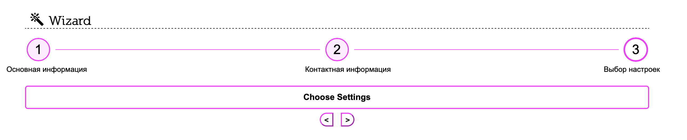

# Pure Tricks

This repository contains handmade:
- css tricks
- build configuration for project markup

Stack:
- `gulp` - build project
- `html` - write html
- `scss` - write styles
- `webpack` - build js
- `js` - imitate behavior


## Installation

Install with [npm](http://www.npmjs.com/):

```sh
$ npm install
```
or with [yarn](https://yarnpkg.com/)
```sh
$ yarn install
```

## Developing

Run develop with command
>`yarn run start:dev`

Get prod builded files with command
>`yarn run build`

## Contains

### Pure CSS Toggler

Allows you to reproduce hide/show logic without any JS.

#### Tips: 
 - Use [general sibling selectors](https://developer.mozilla.org/en-US/docs/Web/CSS/General_sibling_selectors)
to set CSS rules on elements when checkbox change state.
- Use attribute [for](https://developer.mozilla.org/en-US/docs/Web/HTML/Element/label)
on label to link with input state (checked/unchecked).

#### Expamle

[Codepen](https://codepen.io/xenikopa/pen/YzXaMYx)

```html
<input type='checkbox' id='toggler' name='toggler' />
<label for='toggler'>Toggler</label>
<div class='toggler-box'>I can hide and show with checkbox!</div>
```

```css
input[type='checkbox'] {
    display: none;
}
input[type='checkbox'] ~ label {
    cursor: pointer;
}
input[type='checkbox'] ~ .toggler-box {
    display: block;
}
input[type='checkbox']:checked ~ .toggler-box {
    display: none;
}
```

### Wizard With Animations

Wizard - is a component for displaing some step-by-step process. It consists of:

- steps display
- current step content



#### Tips: 

- Use [transitions](https://developer.mozilla.org/ru/docs/Web/CSS/transition) to animate element`s changes
- Use [box-shadow](https://developer.mozilla.org/ru/docs/Web/CSS/box-shadow) to animate border`s changes
- Use [translate](https://developer.mozilla.org/en-US/docs/Web/CSS/transform-function/translate) to animate elemetn`s moving
- Use [content](https://developer.mozilla.org/ru/docs/Web/CSS/content) to use html values in css


